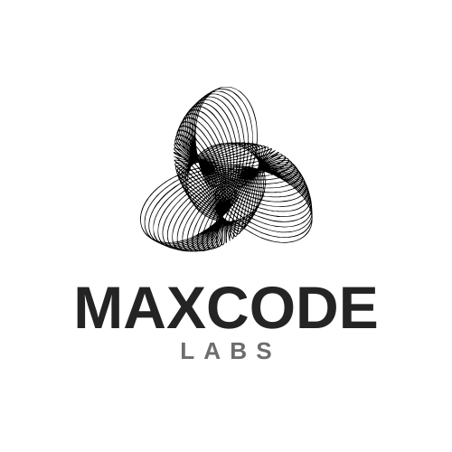

# 🚀 MaxCode Labs

Welcome to **MaxCode Labs** official GitHub repository!  
We are a modern tech startup providing **UI/UX Designing, Web Development, AI Project Development, Personal Portfolios, FYP Projects, and Project Consultation.**

---

## 🌟 What We Do
- 🎨 **UI/UX Design** → Modern Figma-based designs  
- 💻 **Website Development** → Responsive, animated, and professional websites  
- 🤖 **AI Project Development** → ML/AI-powered apps & solutions  
- 🧑‍🎓 **Final Year Projects (FYPs)** → Helping students bring ideas to life  
- 📊 **Consultation** → Technical guidance & project strategy  

---

## 📂 Featured Projects
Here are some demo projects you’ll find in this repo:

1. **Landing Page Template** → A modern startup landing page (HTML/CSS/JS)  
2. **AI Chatbot Demo** → Python-based chatbot powered by NLP  
3. **Portfolio Starter** → A ready-to-use portfolio template for students/professionals  

---

## 🎯 Vision
At **MaxCode Labs**, our mission is simple:  
*Design. Code. Innovate.*  

We aim to empower startups, professionals, and students with **premium designs, smart websites, and innovative AI solutions.**

---

## 📸 Sneak Peek

---

## 📬 Connect With Us
- 🌐 [Website](https://yourwebsite.com)  
- 💼 [LinkedIn](https://linkedin.com/company/maxcode-labs)  
- 📷 [Instagram](https://instagram.com/maxcode_labs)  
- 🐙 [GitHub](https://github.com/maxcodelabs)

---

## 📜 License
This repository is licensed under the MIT License – feel free to use our demos with attribution.
